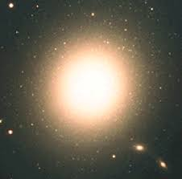
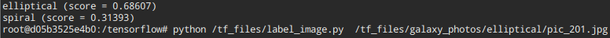
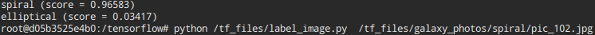

# Tensorflow Elliptical vs Sprial Galaxy Image Classifier

This is the repository developed for 'Image Classifier in TensorFlow in 5 Min on [YouTube](https://youtu.be/QfNvhPx5Px8) using this [CodeLab](https://codelabs.developers.google.com/codelabs/tensorflow-for-poets/?utm_campaign=chrome_series_machinelearning_063016&utm_source=gdev&utm_medium=yt-desc#0) by Google as a guide. 

Scientists can use this classifier to automatically label whether an image taken by telescope is of a Spiral Galaxy or an Elliptical one.

## Requirements

* [docker](https://www.docker.com/products/docker-toolbox)

## Usage 

1. Start the docker image `docker run -it -v ~/projects/dump/tf_files/:/tf_files/ gcr.io/tensorflow/tensorflow:latest-devel`

2. Run the label_image script to label the image. `python /tf_files/label_image.py <path_to_file>`

## Results

### Accuracy

###Test Elliptical Galaxy Image

###Test Spiral Galaxy Image

